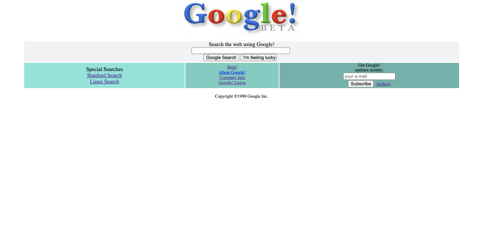

# Installation

Öncelikle projeyi clonelayın.

`https://github.com/sinanbarutcu/google-1998.git`



# Usage

Projeyi cloneladıktan sonra Visual Studio Code programında açınız.

```
cd kitaplik
code .
```

# License

[MIT](https://choosealicense.com/licenses/mit/)

